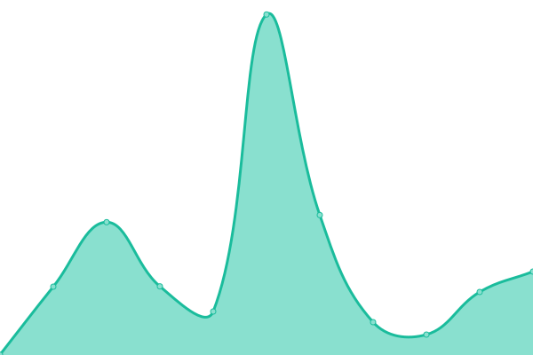
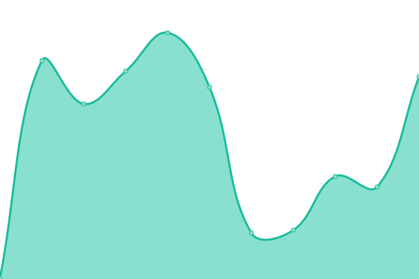

# [📈 Live Status](https://demo.upptime.js.org): <!--live status--> **🟩 All systems operational**

This repository contains the open-source uptime monitor and status page for [Upptime](https://upptime.js.org), powered by [Upptime](https://github.com/upptime/upptime).

With [Upptime](https://upptime.js.org), you can get your own unlimited and free uptime monitor and status page, powered entirely by a GitHub repository. We use [Issues](https://github.com/upptime/upptime/issues) as incident reports, [Actions](https://github.com/upptime/upptime/actions) as uptime monitors, and [Pages](https://demo.upptime.js.org) for the status page.

<!--start: status pages-->
<!-- This summary is generated by Upptime (https://github.com/upptime/upptime) -->
<!-- Do not edit this manually, your changes will be overwritten -->
<!-- prettier-ignore -->
| URL | Status | History | Response Time | Uptime |
| --- | ------ | ------- | ------------- | ------ |
| [blog](https://blog.tmint.dev) | 🟩 Up | [blog.yml](https://github.com/teslamint/uptime/commits/master/history/blog.yml) | 

 632ms
     
 | 

   

| [d'oh!](https://doh.kr) | 🟩 Up | [d-oh.yml](https://github.com/teslamint/uptime/commits/master/history/d-oh.yml) | 

 343ms
     
 | 

   

| [guu.moe](https://guu.moe) | 🟩 Up | [guu-moe.yml](https://github.com/teslamint/uptime/commits/master/history/guu-moe.yml) | 

 370ms
     
 | 

   

| [tmint.dev](https://tmint.dev) | 🟩 Up | [tmint-dev.yml](https://github.com/teslamint/uptime/commits/master/history/tmint-dev.yml) | 

 179ms
     
 | 

   

| [teslam.in](https://teslam.in) | 🟩 Up | [teslam-in.yml](https://github.com/teslamint/uptime/commits/master/history/teslam-in.yml) | 

 348ms
     
 | 

   

| [racl.kr](https://racl.kr) | 🟩 Up | [racl-kr.yml](https://github.com/teslamint/uptime/commits/master/history/racl-kr.yml) | 

 531ms
     
 | 

   

| [tguum.kr](https://tguum.kr) | 🟩 Up | [tguum-kr.yml](https://github.com/teslamint/uptime/commits/master/history/tguum-kr.yml) | 

 289ms
     
 | 

   

| [egloos](https://ice.tguum.kr) | 🟩 Up | [egloos.yml](https://github.com/teslamint/uptime/commits/master/history/egloos.yml) | 

 1619ms
     
 | 

   

<!--end: status pages-->

[**Visit our status website →**](https://demo.upptime.js.org)

## 📄 License

- Code: [MIT](./LICENSE) © [Upptime](https://upptime.js.org)
- Data in the `./history` directory: [Open Database License](https://opendatacommons.org/licenses/odbl/1-0/)
